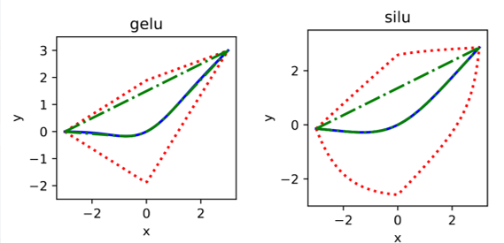

# RSActivationFunctions
Data from Numerical Trials for Forthcoming Manuscript: "Convex and Concave Envelopes of Artificial Neural Network Activation Functions for Deterministic Global Optimization" (hyperlink and citation information will be added once the paper becomes available online)

# Authors
[Matthew E. Wilhelm](https://scholar.google.com/citations?user=sr4baQ0AAAAJ&hl=en&authuser=1), [Chenyu Wang](https://psor.uconn.edu/person/chenyu-wang/), [Matthew D. Stuber](https://cbe.engr.uconn.edu/person/matthew-stuber/)

# Overview of Paper
In the paper associated with this data, we review methods for to constructing convex/concave relaxations of the activation functions which participate artificial neural networks (ANNs). Standard factorable programming techniques used to compute bounds and convex/concave relaxations of such functions may result substantial overestimation due to the occurence of identifical variables in multiple terms as illustrated by this plot of the standard SiLU and GELU functions and along with the associated convex/concave envelopes: 

We detailed relaxations of activation functions defined by peicewise fucntion violate the factorable function requirement and cannot be addressed with previous methods. In order to resolve these issues, we have developed a library of activation function envelopes for many commonly studided rectifier-type and sigmoid activation functions as well as newwe [SiLU](https://arxiv.org/abs/1710.05941) and [GELU](https://arxiv.org/abs/1606.08415) activation functions. These tighter relaxations were shown to translate to a dramatic reduction in CPU runtime required for solving optimization problems involving ANN models to epsilon-global optimality and reduce the number of numerical issues that occur due to over-estimation of intermediate terms. We further demonstrate that the factorable programming approach leads to superior computational performance over alternative state-of-the-art approaches.

# Summary of Data
The raw MLPs and benchmark problems associated with the numerical experiments in Section 5 are listed in the "MLP Benchmarking Set" folder. Results are summarized in table result_summary.xlsx. 

# How to Reproduce Benchmark Results
A CSV file containing the results may be reproduced using in the following fashion. 
1. Clone this git repository to you local machine.
2. Install Julia 1.6 or greater, see [https://julialang.org/downloads/](https://julialang.org/downloads/).
3. Install SCIP and SCIP.jl per the instructions provided at [https://github.com/scipopt/SCIP.jl](https://github.com/scipopt/SCIP.jl)
4. Install GAMS and GAMS.jl per the instructions provided at [https://github.com/GAMS-dev/gams.jl](https://github.com/GAMS-dev/gams.jl), a community version of GAMS may be requested and is sufficient to run the included examples. In the benchmarking suite provided, BARON is accessed through the GAMS suite.
5. Run the file RSActivationfunctions\solver_benchmarking\test_benchmark.jl to generate the results. By default, the neural networks that were randomly generated for this trail stored in the repostory will be loaded and solved although script allows the user to randomly generate new ANNs if desired.

The test_benchmark.jl file use the basic library functionality included in MINLPLib.jl (a version with prebuilt test libraries in this repository for ease of use). The script
will then iterate over all optimizer factory and problem configurations specified and store the results to JSON files. Once all optimization problems are complete a .csv file summarizing the results is generated.

# Associated Repositories
- [McCormick.jl](https://github.com/PSORLab/McCormick.jl) versions 0.10 or greater implements envelopes calculations for relaxations of activaiton functions.
- [EAGO.jl](https://github.com/PSORLab/EAGO.jl) versions 0.7 or greater currently uses the McCormick.jl envelopes for computing relaxations of subproblems.